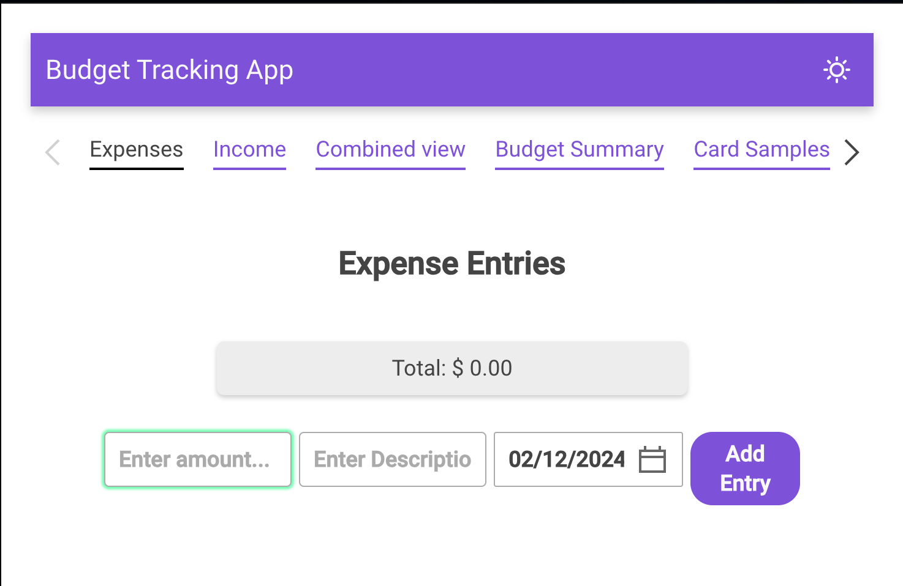

# Budget / Expense Tracker App 

Bugeting app built in React, Node, and Grommet.
This was built as a dev sandbox for learning new technologies, specifically React and Grommet.  

## Table of Contents

- [Overview](#overview)
- [Prerequisites](#prerequisites)
- [Getting Started](#getting-started)
  - [Installation](#installation)
  - [Running the App](#running-the-app)
- [Project Structure](#project-structure)
- [Technologies Used](#technologies-used)
- [Contributing](#contributing)
- [License](#license)

## Overview

TBD

## Prerequisites

- [Node.js](https://nodejs.org/) (Version X.X.X)
- [npm](https://www.npmjs.com/) or [Yarn](https://yarnpkg.com/) package manager

## Getting Started

### Installation

1. **Clone the repository:**

    ```bash
    git clone https://github.com/wiljar00/expense-tracker-grommet.git
    ```

2. **Navigate to the project directory:**

    ```bash
    cd expense-tracker-grommet
    ```

3. **Install dependencies for the frontend:**

    ```bash
    cd frontend
    npm install
    ```

4. **Install dependencies for the backend:**

    ```bash
    cd ../backend
    npm install
    ```

5. **Install global dependencies in the root directory:**

    ```bash
    npm install
    ```

### Running the App

1. **Start the frontend development server:**

    ```bash
    npm run start-frontend
    ```

   The frontend will be accessible at [http://localhost:3000](http://localhost:3000).

2. **Start the backend server:**

    ```bash
    npm run start-backend
    ```

   The backend server will be accessible at [http://localhost:YOUR_BACKEND_PORT](http://localhost:YOUR_BACKEND_PORT).

3. **Open your browser and navigate to [http://localhost:3000](http://localhost:3000) to use the app.**

## Project Structure

TBD

## Technologies Used

List the technologies, frameworks, and libraries used in your project.

- React
- Node.js
- Express
- MongoDB
- ...


## Screenshots:

Demo_v1:
